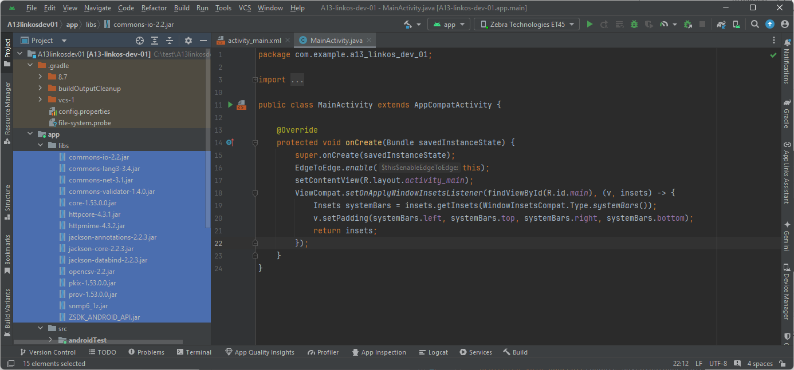

# Link-OS プリンタ向けAndroid アプリケーション開発の手引き v2.0


<br>

<br>

## はじめに

本書は、Zebra Link-OS プリンタ（ZPL）のAndroid アプリケーション開発者向け簡易ガイドです。開発に必要なソフトウェアの入手方法、セットアップ手順、及びSDKのサンプルプログラムについて解説します。

Android 向けの印刷プログラムにはJava/Kolin などの開発言語が利用可能であり、それぞれの開発言語でゼブラプリンタ向けのアプリケーションを作成可能ですが、本書におきましてはjava 言語で開発することを前提に作成されています。java以外の開発言語をご利用の際は、関連のドキュメントや情報源を参照ください。

尚、本ガイドにはプリンタ自体の設定方法については記載をしておりません。プリンタの設定方法についてはユーザーズガイド等をご参照ください。

<br>

<br>

## 開発にあたって必要なマテリアル


<br>

<br>

本スレッドは下記システム環境を想定して説明をしています。

<br>

1. 必要なハードウェア


| Items                | Remarks                             |
| -------------------- | ----------------------------------- |
| Zebra Android Device | Android 13                          |
| Zebra Printer        | Link-OS 7.1                         |
| プリンタケーブル     | ご利用のプリンタに適したUSBケーブル |
| プリンタのサプライ   | ラベル・リボン                      |
| Windows PC           | Win 10以上                          |
<br>

2. 必要なソフトウェア

| Items                      | Remarks                                     |
| -------------------------- | ------------------------------------------- |
| Android Studio             | Android Studio Koala Feature Drop, 2024.1.2 |
| ZebraDesigner3 Developers  | v3.2.2 Build 629                            |
| Link-OS Multiplatform　SDK | 2024 Sep                                    |
| Zebra Setup　Utilities     | version 11.9.*                              |

<br>

<br>

## お勧めの開発フロー


<br>

開発シーンに合わせて開発手法はいろいろありますが、一般的には下記の手順で進めていただくことを推奨いたします。

<br>

1. プリンタの準備新品のプリンタの場合は箱を開梱し、開発に必要な備品が全て揃っているかご確認ください。次に、プリンタにサプライをセットし、運用環境に合わせて用紙設定、接続設定やRFID 設定などをし、印刷可能な準備を整えてください。

   本ガイドにはプリンタ自体の設定方法については記載をしておりません。プリンタの設定方法についてはユーザーズガイド等をご参照ください。

   <br>
2. 印刷フォーマットの生成印刷デザインを決め、印刷フォーマット（ZPL 言語スクリプト）を作成します。出力される印刷デザインやRFID エンコード情報は全てこの印刷フォーマット内で制御されます。本ガイドではZebra Designer 3 Professional を用いた印刷フォーマット作成方法を紹介しています。

   <br>
3. Android アプリケーションを開発します。一般的にAndroid アプリケーションには上位システムとの連携機能、ユーザI/F やZPL 送信処理などが実装します。ご利用の環境に合わせて必要な機能をコーディングください。

   本ガイドではAndroid Studio からLink-OS SDK を参照して、開発する手法を説明いたします。

<br>

<br>

## 開発環境の構築


<br>

### プリンタの準備

ご利用のシーンに合わせてプリンタをセットアップします。

- 接続（TCP/Bluetooth/BLE/USB など）
- 用紙設定
- RFID 設定

本ガイドではプリンタの調整や設定方法については記載をしておりません。プリンタの設定方法についてはユーザーズガイドをご参照ください。

<br>

### アプリ開発環境の準備

Windows PC に開発に必要なソフトウェアをインストールします。

<br>

##### Zebra Designer 3 Developer のダウンロードとインストール

印刷デザインを生成するためのソフトウェアをダウンロードし、インストールします。

https://www.zebra.com/us/en/support-downloads/printer-software/zebradesigner-3-developer.html

\* Zebra HP へのアクセスが初めての方はユーザ登録（無料）が必要となります。

<br>

##### Android Studio のインストール

アプリケーション開発ソフトウェアをダウンロードし、インストールします。Google の規約や手順に従って、Android Studio をWindows PC にインストー

ルください。Android Studio はご利用のLink-OS SDK に適したものをご利用ください。

https://developer.android.com/

<br>

##### Link-OS SDK のダウンロードとインストール

下記リンクよりプログラムをWindows PC にWindows Installer 版をダウンロードし、インストールします。

https://www.zebra.com/gb/en/support-downloads/software/printer-software/link-os-multiplatform-sdk.html

<br>

##### Zebra Setup Utilities のダウンロードとインストール（推奨）

下記リンクよりプログラムをWindows PC にWindows Installer 版をダウンロードし、インストールします。

https://www.zebra.com/jp/ja/support-downloads/software/printer-software/printer-setup-utilities.html

<br>

##### Zebra Printer Fonts のダウンロードとインストール（必要に応じて）

下記リンクよりプリンタ用のフォントを入手し、インストールします。

https://www.zebra.com/jp/ja/support-downloads/software/printer-software/printer-fonts.html

<br>

<br>

## 印刷フォーマットデザインの作成

ラベルやレシートの印刷デザインを生成します。RFID のエンコードが必要な場合もここで設定します。

<br>

##### 印刷フォーマットの生成

1. Zebra Designer 3 を起動し、任意のラベルフォーマットを作成します。

   

   ※本ガイドではZebra Designer 3 の操作については割愛します。

   <br>
2. ツールバーの保存を選択します。
3. 保存画面で下記設定にし、を選択します。

   

   ※ [送信先]-[ローカルディスク]は作成したテンプレートの保存先となります。任意の場所を選択ください。

   <br>
4. [送信先]-[ローカルディスク] で設定したフォルダにZPL スクリプトファイルができていることを確認します。スクリプトの内容はテキストエディタで確認が可能です。

    **例、mytest01.prn の内容抜粋**
    ```
    ### テンプレート部分

    CT~~CD,~CC^~CT~
    ^XA
    ^DFE:demo01.ZPL^FS
    ~TA000
    （省略）
    ^PW831
    ^LL609
    ^LS0
    ^FT95,87^A0N,17,18^FH\^CI28^FN1^FDtext1^FS^CI27
    ^BY2,3,122^FT92,249^BCN,,Y,N,,A
    ^FN2^FDBarcode1^FS
    ^XZ

    ### 可変データ部分

    <?xml version="1.0" standalone="no"?>
    <labels _FORMAT="E:demo01.ZPL" _QUANTITY="1" _PRINTERNAME="ZDesigner for Developers - Generic Printer 200dpi" _JOBNAME="demo01">
        <label>
            <variable name="text1">This is text.</variable>
            <variable name="Barcode1">123456789012</variable>
        </label>
    </labels>
    ```


c

1. 必要に応じてprnファイルの内容を更新ください。

   ※ 各コマンドの詳細についてはProgramming Guide (ZPL2 の項)を参照ください。

<br>

<br>

## Android Studioの開発環境構築

Android Studioにて、Link-OS SDKが利用できるようにします。

<br>

1. 新規Android Projectを作成する。
2. ツリーウィンドウの表示を[Project]に変更する。
3. app配下に**libs**ディレクトリを作成する。

   

   <br>
4. 解凍済みのSDKのライブラリファイル（**[Install Dir]/android/[build version]/lib/\***）を作成した***AndroidProject/app/libs***下にコピーする。

   

   <br>
5. コピー先のライブラリファイルを全て選択し、右クリックメニューから**"Add As Library..."**を選択。
6. 開発環境に合わせて、モジュールを選択する。

7.**AndroidProject/app/src/build.gradle**を開き、jarファイルが全てライブラリ登録されていることを確認する。

   

   <br>

8. 同gradle.buildの**android{}**内に下記を追記する。

   <pre>
        packaging {
        resources{
            excludes += "META-INF/DEPENDENCIES"
            excludes += "META-INF/LICENSE.txt"
            excludes += "META-INF/NOTICE.txt"
            excludes += "META-INF/NOTICE"
            excludes += "META-INF/LICENSE"
        }
    }
    </pre>

   <br>

   

   <br>
9. ツリーウィンドウをAndroidに変更する。
10. ProjectをSyncする。

    

    <br>
11. MainActivity.java等で link-os sdkがインポートできることを確認する。

    

<br>

<br>

## SDKの詳細情報とサンプルプログラムの入手

1. Link-OS SDK の内容物

   PC にインストールしたLink-OS には下記マテリアルが含まれています。

   - SDK の解説書（HTML）
   - サンプルプログラム

   <br>
2. Android 開発に関するマテリアルは下記フォルダに格納されています。

   InstallDirectory\zebra-linkos-mpsdk-xxx-YYYY\android\vx.xx.xxxx

   

   <br>
3. sdk_welcome.html を選択することにより、SDK の解説を確認することができます。

    

    <br>

1. 下記のリンクでも開発に関わる最新情報を入手できますので、ご一読ください。

   [Zebra.com/ Link-OS™ Multiplatform SDK](https://www.zebra.com/jp/ja/software/printer-software/multiplatform-sdk.html)

   [Zebra Developers/ Link-OS Multiplatform SDK](https://developer.zebra.com/products/printers/link-os-multiplatform-sdk)

<br>

<br>

---

Enjoy Zebra!!
